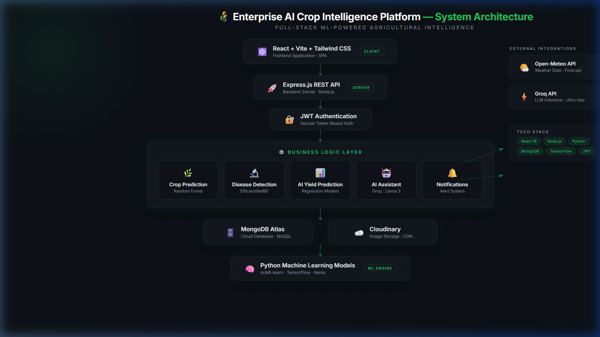
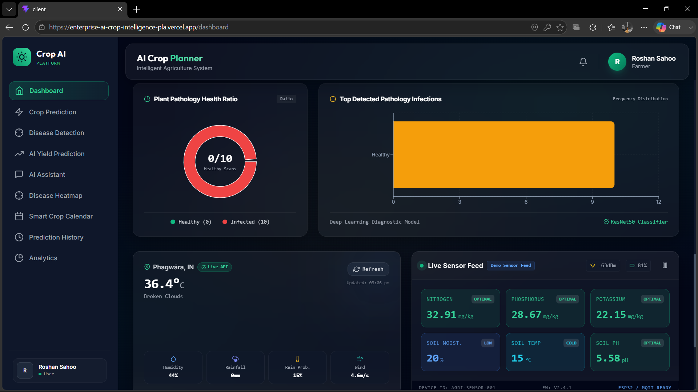
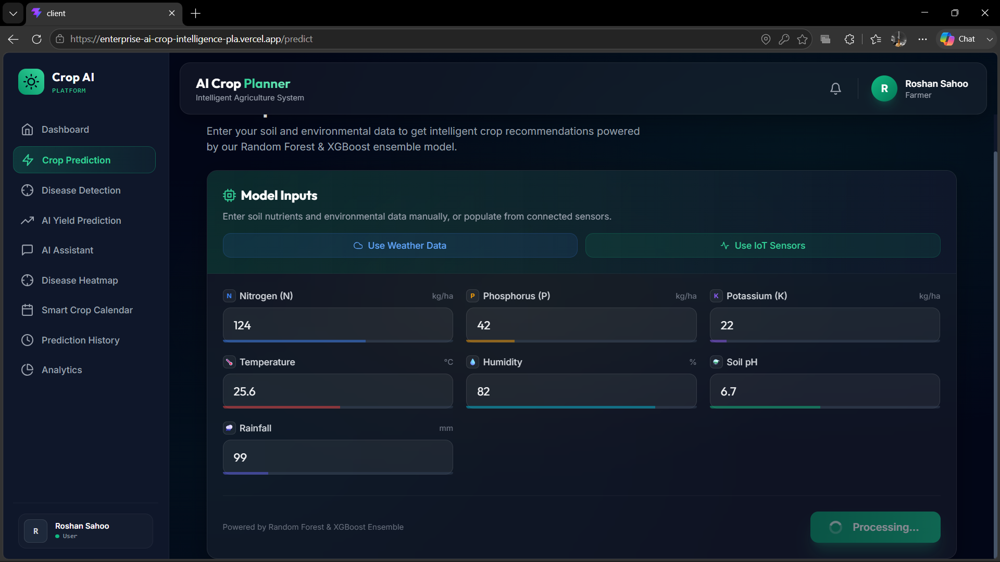
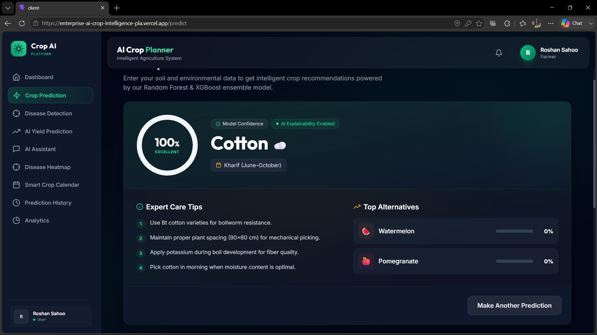
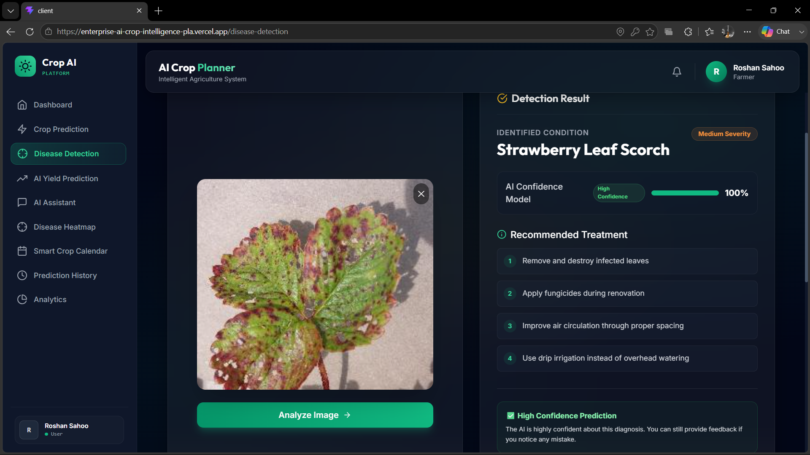
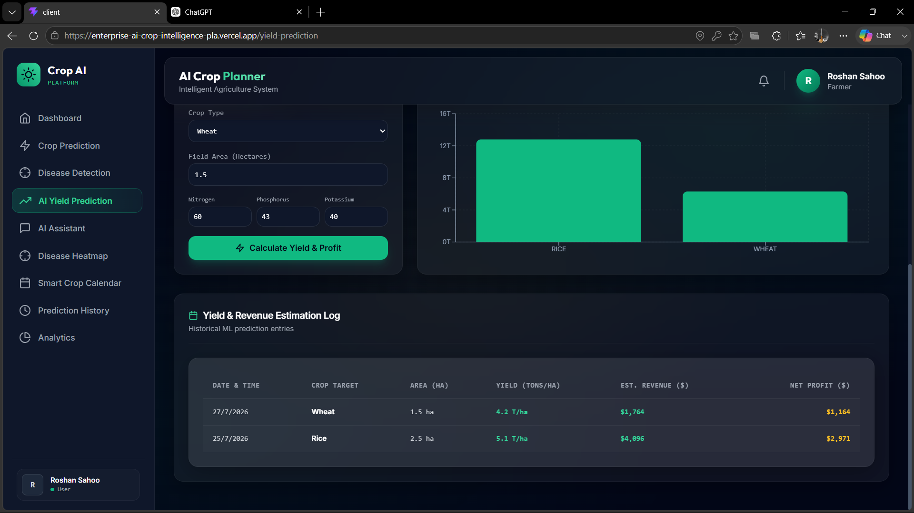
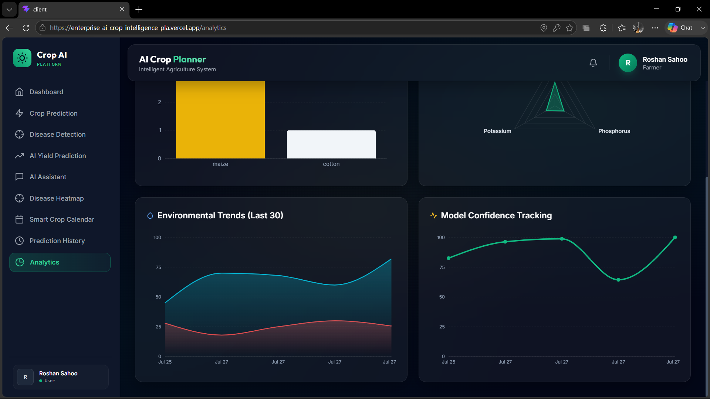
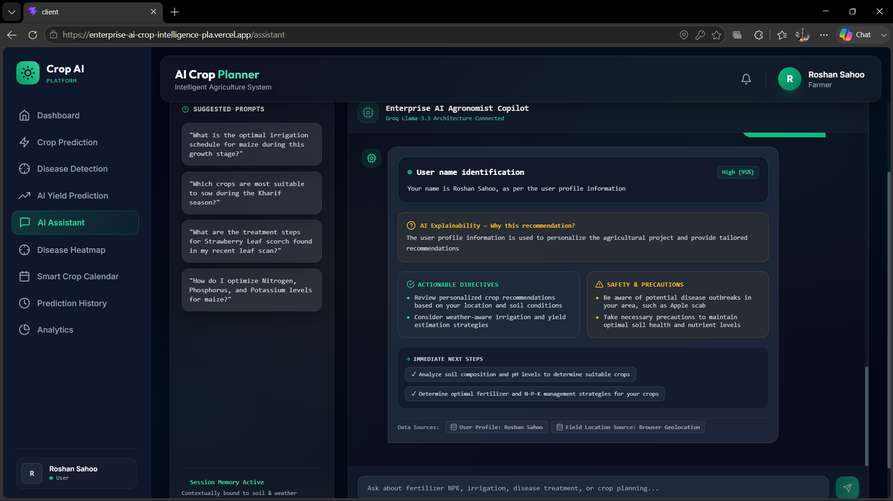
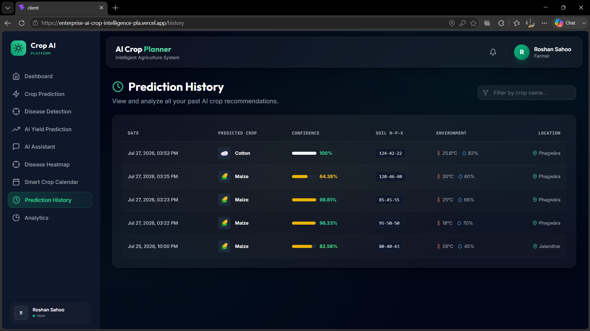
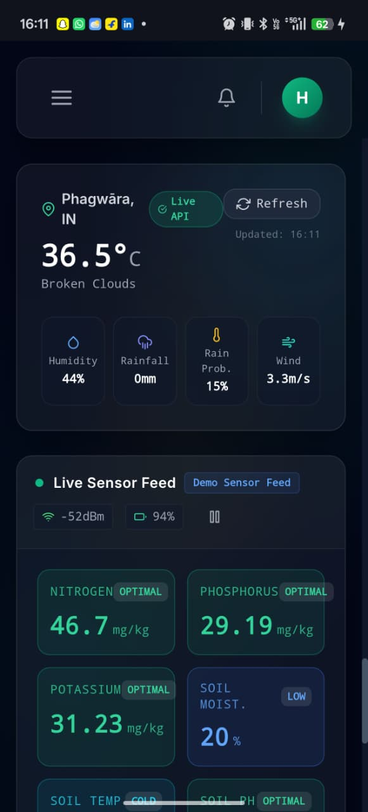

# 🌾 Enterprise AI Crop Intelligence Platform

> **Release Candidate v1.0** — 🚀 Enterprise-grade MERN + Machine Learning platform for intelligent crop recommendation, disease detection, yield prediction, and AI-powered agricultural decision support.

---

## 📋 Overview

The **Enterprise AI Crop Intelligence Platform** is a full-stack, AI-powered agricultural planning and decision-support ecosystem. Built using Node.js, Express, React (Vite/TailwindCSS), MongoDB, and Groq LLM architecture, the platform enables farmers and agricultural administrators to run precision crop recommendation models, ResNet50/EfficientNet leaf pathology diagnostics, ML-driven yield and revenue estimation, national disease outbreak heatmaps, and context-aware conversational AI assistance.

---

## 📚 Table of Contents

- Overview
- Live Demo
- Platform Architecture
- Key Features
- Technology Stack
- Application Screenshots
- Project Structure
- Installation
- API Documentation
- Security
- Deployment
- License

---

## 🚀 Live Demo

[](https://enterprise-ai-crop-intelligence-pla.vercel.app)

[](https://enterprise-ai-crop-backend.onrender.com)

---

## 🏗️ Platform Architecture

<p align="center">
  
</p>

---

## ⭐ Key Features

🌾 **AI Crop Recommendation**
- Recommends the most suitable crop using a Random Forest model based on soil nutrients (NPK), temperature, humidity, pH, and rainfall with confidence scores.

🍃 **AI Plant Disease Detection**
- Detects plant leaf diseases using EfficientNetB0 deep learning model with confidence score, severity analysis, treatment recommendations, and prevention tips.

📈 **AI Yield Prediction**
- Predicts expected crop yield and estimated revenue using machine learning models and environmental parameters.

🤖 **AI Farming Assistant**
- Powered by Groq Llama 3.3 to answer farming queries, provide agricultural guidance, and generate AI-powered farm reports.

🗺️ **Disease Heatmap**
- Visualizes regional disease outbreaks with risk levels and trend analysis to support better farming decisions.

📅 **Smart Crop Calendar**
- Provides crop lifecycle stages, irrigation schedules, fertilizer recommendations, and farming reminders.

📊 **Analytics Dashboard**
- Displays prediction history, crop statistics, disease trends, AI insights, and system performance through interactive charts.

🔐 **Secure Authentication**
- JWT-based user authentication with encrypted passwords, protected routes, and role-based access control.

☁️ **Cloud Image Storage**
- Stores uploaded crop images securely using Cloudinary with prediction history maintained in MongoDB Atlas.

📱 **Responsive User Interface**
- Fully responsive design optimized for desktop, tablet, and mobile devices using React, Tailwind CSS, and Framer Motion.

---

## 🛠️ Technology Stack

| Layer | Technology |
|-------|------------|
| **Frontend UI** | React 19, Vite, TailwindCSS, Recharts, Framer Motion, React Router 7 |
| **Backend Server** | Node.js, Express.js, JWT Authentication, Security Sanitizer, Rate Limiter |
| **Database** | MongoDB (Mongoose ODM) |
| **AI / ML Models** | Random Forest (Crop Rec), ResNet50 / EfficientNet (Disease Detection), Groq LLM (llama-3.3-70b) |
| **Telemetry APIs** | Open-Meteo Weather API, OSM Nominatim Reverse Geocoding |
| **Cloud Services** | Cloudinary, MongoDB Atlas |
| **Libraries** | Axios, React Hook Form, Recharts, Framer Motion |

---

# 📸 Application Screenshots

## 🏠 Dashboard

<p align="center">
  
</p>

---

## 🌾 Crop Prediction

### Input Form

<p align="center">
  
</p>

### Prediction Result

<p align="center">
  
</p>

---

## 🍃 Disease Detection

<p align="center">
  
</p>

---

## 📈 AI Yield Prediction

<p align="center">
  
</p>

---

## 📊 Analytics Dashboard

<p align="center">
  
</p>

---

## 🤖 AI Assistant

<p align="center">
  
</p>

---

## 📜 Prediction History

<p align="center">
  
</p>

---

## 📱 Mobile Responsive UI

<p align="center">
  
</p>

---

## 📁 Project Structure

```
AI-Crop-System/
├── client/                      # React Frontend Console
│   ├── src/
│   │   ├── components/          # Reusable UI Primitives & Response Cards
│   │   ├── context/             # Auth Context Provider
│   │   ├── hooks/               # Custom Hooks (useWeather, useIoT)
│   │   ├── pages/               # Application Pages (Dashboard, Predict, Assistant, MLOps)
│   │   ├── services/            # Axios API Client Wrappers
│   │   ├── utils/               # PDF Generator, Toast Notifications
│   │   └── App.jsx              # Lazy Route Definitions & Fallbacks
├── server/                      # Express Backend Server
│   ├── config/                  # DB Connection & Env Validation
│   ├── controllers/             # Core & Admin API Controllers
│   ├── middleware/              # Auth, Error Handler, Security Sanitizer
│   ├── models/                  # Mongoose Schema Definitions
│   ├── routes/                  # Express Endpoint Definitions
│   ├── services/                # Model Serving, Groq Service, Weather Caching
│   └── server.js                # Server Entrypoint & Shutdown Handlers
```

---

## 🚀 Installation & Setup Instructions

### Prerequisites
- Node.js (v18+ recommended)
- MongoDB running locally or a MongoDB Atlas URI

### 1. Backend Environment Configuration
Create a `.env` file inside the `server/` directory:
```env
PORT=5000
NODE_ENV=production
MONGO_URI=mongodb://localhost:27017/crop-planning
JWT_SECRET=your_jwt_secret_key_here
CLIENT_URL=http://localhost:5173
GROQ_API_KEY=your_groq_api_key_here
OPENWEATHER_API_KEY=your_openweather_key_optional
```

### 2. Install & Start Server
```bash
cd server
npm install
npm start
```

### 3. Install & Build Client
```bash
cd client
npm install
npm run build
```

---

## 📖 API Documentation Summary

| Route Path | Method | Auth | Description |
|------------|--------|------|-------------|
| `/api/auth/register` | POST | Public | User registration with hashed password |
| `/api/auth/login` | POST | Public | User login returning JWT token |
| `/api/predict/recommend` | POST | User | Run ML crop recommendation inference |
| `/api/disease/detect` | POST | User | Run leaf pathology diagnostic image scan |
| `/api/yield/predict` | POST | User | Estimate harvest tonnage & revenue |
| `/api/assistant/chat` | POST | User | Send query to Groq AI Copilot with context |
| `/api/assistant/farm-report` | GET | User | Fetch consolidated telemetry for PDF report |
| `/api/disease-heatmap/regions` | GET | User | Regional disease risk metrics |
| `/api/crop-calendar/schedule` | GET | User | 6-stage crop lifecycle timeline |
| `/api/admin/observability/metrics` | GET | Admin | System health score, memory, & model metrics |

---

## 🛡️ Security & Performance Verification

- [x] **Rate Limiting**: 50 max authentication attempts per 15-minute window.
- [x] **Input Sanitization**: Express middleware strips `$`, HTML, and `<script>` injections from input parameters.
- [x] **Weather Caching**: 12-minute in-memory caching in `weatherService.js` prevents duplicate external requests.
- [x] **Global Error Handling**: Top-level `<ErrorBoundary>` catches component crashes gracefully.
- [x] **Zero React Warnings/Errors**: production bundle built cleanly (`npm run build`).

---

## 📝 License & Release Status

- **Status**: Release Candidate v1.0 (Production Ready)
- **License**: MIT Enterprise Agriculture License

---

## 🌐 Deployment

| Service | Platform |
|---------|----------|
| Frontend | Vercel |
| Backend | Render |
| Database | MongoDB Atlas |
| Image Storage | Cloudinary |
| ML Engine | Python + Scikit-learn + TensorFlow |

---

## 👨‍💻 Author

**Roshan Sahoo**

AI & ML | Full Stack Developer

- GitHub: https://github.com/roshansahoo2004
- LinkedIn: https://www.linkedin.com/in/roshansahoo/ 